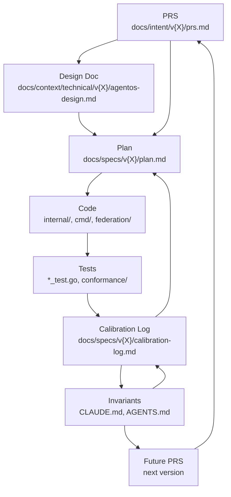

# Artifact Traceability — AgentOS Platform

How project artifacts relate to each other, how to trace any decision or invariant
back to its origin, and how the AgentOS artifact model maps to Fury Road.

Target audience: human developers and AI agents operating in this repo.

---

## 1. Artifact Dependency DAG

Artifacts flow in a directed acyclic graph. Each artifact type feeds the next.
The final output (invariants) feeds back into future PRS, closing the loop.

```
PRS (product requirements — Tier 1, human-approved)
 |
 v
Design Doc (architecture decisions — Tier 1)
 |
 v
Plan (issues, file ownership, acceptance criteria — Tier 2, AI-autonomous)
 |
 v
Code (implementation — Tier 3, one issue per commit)
 |
 v
Tests (validation — Tier 3, required per Gate 1)
 |
 v
Calibration Log (scoring, failure classification — Tier 2, append-only)
 |
 v
Invariants (CLAUDE.md, AGENTS.md updates — compounded rules)
 |
 v
Future PRS (informed by learnings — cycle repeats)
```

### Mermaid representation



### Supporting artifacts (not in the main chain)

| Artifact | Role in DAG | Location |
|----------|-------------|----------|
| AI_CONTRACT.md | Constrains all agents at every stage | Root |
| docs/governance/spec-authority.md | Resolves conflicts between Tier 1 docs | Root |
| Proposals | Change requests for Tier 1 docs | `docs/proposals/` |
| Prompts | Thin execution context for agents | `docs/automation/prompts/` |
| Progress Log | Non-normative execution ledger | `docs/specs/v{X}/progress-log.md` |
| Git Issues | Derived tracking from plan.md | GitHub Issues |

---

## 2. Traceability Walkthrough: "No Unbounded Collections"

This section traces one real invariant from its current form back to its origin,
demonstrating the full backward path through the DAG.

### Step 1: Current rule (CLAUDE.md line 78)

> **No unbounded in-memory collections** -- every `map` or `slice` that grows
> with requests MUST have eviction, TTL, or a size cap.
> *(Learned from: v1.035 -- 3 memory leaks in TokenBudget.windows,
> fileEventLogStore.runs, Executor.eventSinks; escalation trigger at
> 3 occurrences)*

Also present in AGENTS.md lines 56-59 (Bounded Collections section) with
implementation guidance: use `sync.Map` with periodic cleanup or LRU with
max entries.

### Step 2: Gate 3 hard-fail criterion (multi-agent-calibration-loop.md line 471)

> No new unbounded collections (maps/slices growing with requests without
> eviction or cap) -- Hard fail, 10 points

Elevated from a scored criterion to a hard-fail on 2026-03-08.

### Step 3: Source -- v1.035 calibration log (retroactive validation)

Three specific memory leaks were found during retroactive validation of v1.035:

| Location | Unbounded Collection | Growth Trigger |
|----------|---------------------|----------------|
| `TokenBudget.windows` | `map` growing per request window | Every token budget check |
| `fileEventLogStore.runs` | `map` growing per run | Every new agent run |
| `Executor.eventSinks` | `map/slice` growing per SSE connection | Every new SSE subscriber |

All three shipped without eviction, TTL, or size caps.

### Step 4: Original PRS gap

The v1.035 PRS did not require bounded collections. The requirements specified
what each subsystem should do (token budgets, event logging, SSE streaming) but
not how in-memory state should be managed over time.

### Step 5: Failure classification

The calibration loop classified all three as **steering gaps** -- the agents
lacked a constraint telling them to bound in-memory collections. The spec was
not at fault (it does not prescribe implementation details at this level); the
steering files (CLAUDE.md, AGENTS.md) were missing the rule.

With 3 occurrences of the same pattern in a single version, the escalation
trigger fired (recurring failure threshold).

### Step 6: Correction applied

| Target | Action |
|--------|--------|
| CLAUDE.md | Added invariant: "No unbounded in-memory collections" with learned-from reference |
| AGENTS.md | Added implementation guidance under "Bounded Collections" section |
| Gate 3 rubric | Elevated from scored (5 pts) to hard-fail (10 pts) |
| Calibration log | Logged as steering gap with 3 instances, escalation triggered |

The correction compounds: every future executor agent reads CLAUDE.md and
AGENTS.md before writing code. The Validator checks Gate 3 as a hard-fail
criterion. The same class of leak cannot ship again.

### Trace summary (reverse order)

```
INVARIANT  CLAUDE.md:78, AGENTS.md:56-59
   ^
GATE 3     Hard-fail criterion (elevated 2026-03-08)
   ^
CAL LOG    v1.035 retroactive validation, 3 memory leaks found
   ^
CODE       TokenBudget.windows, fileEventLogStore.runs, Executor.eventSinks
   ^
PRS        v1.035 PRS -- no bounded-collection requirement (gap)
   ^
CLASS      Steering gap (3 occurrences, escalation trigger)
```

---

## 3. Fury Road Mapping

Each AgentOS artifact maps to a Fury Road concept and settlement.

| AgentOS Artifact | Fury Road Concept | Settlement | Notes |
|------------------|-------------------|------------|-------|
| PRS (`docs/intent/v{X}/prs.md`) | Spec | Citadel | Must exist before first commit; scored at Gas Town |
| Design Doc (`docs/context/technical/v{X}/agentos-design.md`) | Architecture decision | Citadel | Architecture conformance scored at Citadel gate |
| Plan (`docs/specs/v{X}/plan.md`) | Faction work breakdown | War Rig | Decomposes spec into executable units |
| Code (`.go` files) | Polecat output | Gas Town | Agent-produced, scored against rubric |
| Tests (`*_test.go`, conformance) | Green Place evidence | Green Place | Test coverage, acceptance criteria, regression delta |
| Calibration Log | Scorecard history + correction records | Ledger | Append-only, drives learning loop |
| CLAUDE.md | Steering file | Gas Town input | Behavioral constraints, not suggestions |
| AGENTS.md | Steering file + KB | Gas Town input | Implementation guidance, calibration-learned rules |
| AI_CONTRACT.md | Governance contract | Citadel | Non-negotiable operating rules |
| docs/governance/spec-authority.md | Spec authority / conflict resolution | Citadel | Precedence rules for competing documents |
| Gate scoring (Gates 0-5) | Settlement gates | All settlements | Each gate maps to one or more settlements |
| Failure classification | Correction record type | Feedback loop | Rubric gap, KB gap, steering gap, etc. |
| Proposals (`docs/proposals/`) | Spec change requests | Citadel | Tier 1 change flow |
| Circuit breaker escalation | Hard fail + human review | Thunderdome | 3 iterations max, then human decides |

### Gate-to-Settlement mapping

| AgentOS Gate | Fury Road Settlement | Resource |
|--------------|---------------------|----------|
| Gate 0: File Scope | War Rig (routing constraint) | -- |
| Gate 1: Tests | Green Place | All three |
| Gate 2: Spec Compliance | Citadel | Water |
| Gate 3: Invariants | Bullet Farm + Gas Town | Bullets + Gas |
| Gate 4: Acceptance Criteria | Green Place | All three |
| Gate 5: Code Quality | Gas Town + Bullet Farm | Gas + Bullets |

### Failure classification mapping

| AgentOS Classification | Fury Road Correction Type | Fix Target |
|------------------------|--------------------------|------------|
| Spec gap | Rubric gap / Spec template gap | Rubric Registry, spec template |
| Plan gap | KB gap | Project KB (plan.md) |
| Code bug | Agent behavior | Prompt/molecule, KB reinforcement |
| Guidance gap | Steering file gap | CLAUDE.md / AGENTS.md |
| Scope violation | Agent behavior | War Rig routing rules |
| Environment gap | KB gap | Team KB (CI/infra docs) |
| Edge case | Edge case | Flagged human-only |

---

## 4. How to Trace "Why Does This Rule Exist?"

Step-by-step instructions for an AI agent to trace any invariant back to its
origin failure. Use this when you encounter a rule and need to understand its
purpose before modifying or questioning it.

### Procedure

**Step 1: Locate the rule.**
Search CLAUDE.md and AGENTS.md for the rule text. Note the line number and
any "Learned from" annotation.

**Step 2: Read the "Learned from" reference.**
Every calibration-learned invariant in CLAUDE.md includes a parenthetical
with the version and specific failures. Example:
`(Learned from: v1.035 -- 3 memory leaks in TokenBudget.windows, ...)`

**Step 3: Find the calibration log entry.**
Open `docs/specs/v{VERSION}/calibration-log.md`. Search for the specific
failure mentioned in the learned-from reference. The log entry contains:
- Failure classification (spec gap, plan gap, code bug, guidance gap, etc.)
- Correction target (where the fix was applied)
- Novel/recurring flag
- Gate scores at the time of failure

**Step 4: Find the code that caused the failure.**
The calibration log entry references an issue number. Use the issue number
to find the commit: `git log --grep="#N"` where N is the issue number.
The commit diff shows the code that was flagged.

**Step 5: Find the original PRS.**
Open `docs/intent/v{VERSION}/prs.md`. Check whether the
requirement that would have prevented this failure existed. If it did not,
the failure classification should be "spec gap" or "steering gap."

**Step 6: Verify the correction chain.**
Confirm that the fix was applied to the correct target:
- Steering gap -> CLAUDE.md and/or AGENTS.md updated
- Spec gap -> Proposal filed and applied to PRS
- Plan gap -> plan.md acceptance criteria tightened
- Code bug -> Code fixed in a subsequent commit
- Rubric gap -> Gate criteria updated in process doc

**Step 7: Check for recurrence.**
Search later calibration logs for the same failure pattern. If the rule
was effective, no recurrence should appear. If recurrence exists, the
correction was insufficient and may need escalation.

### Quick reference command

To find all invariants and their origins:

```bash
grep -n "Learned from:" CLAUDE.md
```

To find calibration log entries for a specific version:

```bash
ls docs/specs/v*/calibration-log.md
```

---

## 5. Cross-Reference Index

Every calibration-learned invariant, mapped to its origin version, specific
failures, correction type, and where the fix was applied.

| # | Invariant | Version Learned | Specific Failure(s) | Correction Type | Fix Applied To |
|---|-----------|-----------------|---------------------|-----------------|----------------|
| 1 | No `_ = err` without nolint annotation | v1.04, v1.035 | v1.04 Track 5: only 2/7 items fixed; v1.035 OpenAI shim; v1.04 Track 8 | Steering gap | CLAUDE.md:77, AGENTS.md:52-54, Gate 3 hard-fail |
| 2 | No unbounded in-memory collections | v1.035 | TokenBudget.windows, fileEventLogStore.runs, Executor.eventSinks (3 memory leaks) | Steering gap | CLAUDE.md:78, AGENTS.md:57-59, Gate 3 hard-fail |
| 3 | Auth code must fail closed | v1.035, v1.05 | v1.035 Track 1: MetricsRequireAuth defaults false on bad input; v1.05 Track 12: OIDC middleware falls through | Steering gap | CLAUDE.md:79, AGENTS.md:62-64, Gate 3 hard-fail |
| 4 | New packages require test files | v1.035, v1.04 | v1.035: metrics, event log, SSE shipped with zero tests; v1.04: 6 packages with zero test files | Steering gap | CLAUDE.md:80, AGENTS.md:67-68, Gate 3 hard-fail |
| 5 | Postgres code requires integration tests | v1.03, v1.04 | v1.03 Track 6: postgres sentinel mismatch (production bug); v1.04 Tracks 3, 8 | Steering gap | CLAUDE.md:81, AGENTS.md:68-69, Gate 3 hard-fail |
| 6 | Specs must match implementation scope | v1.05 | Track 6: "Postgres-backed" but in-memory; Track 8: "streaming" but truncation; Track 13: migration CLI missing | Steering gap | CLAUDE.md:82, AGENTS.md:72-74, Gate 3 hard-fail |

### Anti-patterns (from process doc, also calibration-learned)

| Anti-Pattern | Version Learned | Specific Failure | Correction Type |
|--------------|-----------------|------------------|-----------------|
| `replace_all` self-reference trap | v1.025 | Iteration 5, Correction #3: `newTestServer` recursive self-call | Guidance gap |
| Scoring without Gate 1 execution | v1.025 | All 11 issues scored "95 pending CI", masking 3 bugs | Rubric gap |
| Process bypass under speed pressure | v1.03-v1.05 | Monolithic commits, no per-issue validation, 18+ failures in v1.035 alone | Steering gap |
| Auth fails open | v1.035, v1.05 | MetricsRequireAuth false default; OIDC fall-through | Steering gap |
| New subsystem without tests | v1.035, v1.04 | 3 subsystems (v1.035) + 6 packages (v1.04) with zero tests | Steering gap |
| Aspirational specs | v1.05 | 3 tracks with spec/implementation mismatch | Steering gap |

### Elevation history

All six invariants in the cross-reference index were originally **scored criteria**
(5 points each) in the gate rubric. They were elevated to **hard-fail criteria**
on 2026-03-08 after retroactive validation of v1.03-v1.05 demonstrated that
scored criteria with low point values did not prevent recurrence. The elevation
rationale is documented in `docs/process/multi-agent-calibration-loop.md` at
line 476.

---

## Related Documents

| Document | Path | Relevance |
|----------|------|-----------|
| CLAUDE.md | `/CLAUDE.md` | Invariants with learned-from references |
| AGENTS.md | `/AGENTS.md` | Implementation guidance for calibration-learned rules |
| Calibration Loop | `docs/process/multi-agent-calibration-loop.md` | Full process definition |
| Fury Road Design | `../nexixai-fury-road/fury-road-design-v.07-draft.md` *(sibling repo)* | Settlements, scoring, feedback loop |
| AI Contract | `/AI_CONTRACT.md` | Non-negotiable operating rules |
| SPEC_AUTHORITY.md | `docs/governance/spec-authority.md` | Conflict resolution and precedence |
